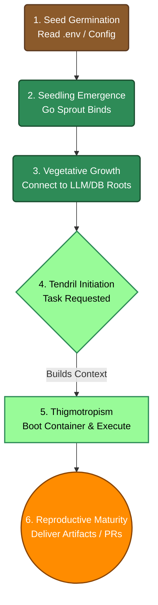

# OpenTendril Architecture & Pluggable Microservices

This document defines the target-state architecture and data-flow specifications for OpenTendril. As the system evolves from a monolithic Python script into a distributed set of services, this document serves as the implementation blueprint.

---

## 1. Decoupled Service Topography

OpenTendril is split into distinct, specialized services. This allows the CLI/protocol gateway to remain lightweight and compile to a single Go binary, while keeping heavy AI dependencies isolated within the Python sandbox environment.

```
                 ┌────────────────────────────────────────────────────────┐
                 │                       CLIENTS                          │
                 │   LibreChat (Web)  │  Cursor / VSCode  │  Claude CLI   │
                 └───────────────────────────┬────────────────────────────┘
                                             │ (MCP over stdio / SSE)
                                             ▼
                 ┌────────────────────────────────────────────────────────┐
                 │                 LIGHTWEIGHT GO SPROUT                  │
                 │   `tendril -mcp` (Instant boot, proxy routing)         │
                 └──────┬────────────────────┬─────────────────────┬──────┘
                        │                    │                     │
                        ▼                    ▼                     ▼
             ┌─────────────────────┐ ┌──────────────┐   ┌─────────────────────┐
             │    SANDBOX CORE     │ │  MEMORY/RAG  │   │     LLM ROUTER      │
             │   (Python/Docker)   │ │ (SQLite/MCP) │   │ (Ollama/Cloud/vLLM) │
             └─────────────────────┘ └──────────────┘   └─────────────────────┘
```

### The Headless Kernel Split (Brain vs. Hands)

To maximize safety and efficiency, OpenTendril enforces a strict separation of concerns between the client interface (the Brain) and the execution kernel (the Hands):

* **The Brain (Client App):** High-end user interfaces (like Claude Desktop, ChatGPT CLI, or VS Code) handle high-level reasoning, system design, prompt construction, and external internet searches.
* **The Hands (OpenTendril Kernel):** OpenTendril runs locally or in a sandbox. It receives structured requests (such as "read file X" or "run build compilation Y") via the Model Context Protocol (MCP) and executes them securely, returning raw outputs back to the client.

This means OpenTendril does not need to duplicate chat interfaces or search tools; it focuses entirely on the secure execution and manipulation of code assets.

### A. The Go Sprout (`tendril`)
* **Role:** Low-overhead protocol adapter and system orchestrator.
* **Responsibilities:**
  * Runs on the host machine as the primary API surface.
  * Listens to incoming client requests via MCP (stdio/SSE), OpenAI HTTP REST APIs (`/v1/chat-completions`), and WebSockets.
  * Translates stdio JSON-RPC payloads into simple HTTP requests and routes them to the active Python backend container.
  * Auto-starts the Docker containers via `docker compose up -d` if it detects that the Python backend is offline.

### B. The Sandbox Core (Python)
* **Role:** Safe execution backend for files, tests, and bash environments.
* **Responsibilities:**
  * Operates strictly inside containerized sandboxes.
  * Listens on the internal HTTP relay port (`9999`).
  * Executes standard file operations (`read_file`, `write_file`, surgical patch applications), runs test suites (`pytest`), and checks Python syntax via compiling.
  * Isolates unverified code execution from the developer's host machine.

### C. The LLM Router (Python)
* **Role:** Gateway to cloud and local inference engines.
* **Responsibilities:**
  * Resolves LLM calls using native SDK adapters (Anthropic, OpenAI, Google) or OpenAI-compatible local APIs (Ollama, OpenLLM).
  * Manages provider-specific failovers with exponential backoff if primary models hit rate limits.
  * Decouples the prompt engineering templates from the actual tool execution.

### C. The 6-Stage Growth Model (Framework Lifecycle)
The execution flow of the OpenTendril framework natively maps to the six major growth stages of a climbing vine:

1. **Seed Germination (Activation):** The user installs OpenTendril. The Core reads `.env` and `mcp_config.json`, absorbing its environment.
2. **Seedling Emergence (Sprouting):** The Go Sprout breaks through and binds to local ports, establishing the main API surface.
3. **Vegetative Growth (Stem Elongation):** The core orchestrator ("The Stem") runs initial diagnostics and builds connections to LLM providers and local vector databases ("The Roots").
4. **Tendril Initiation:** When a specific task is requested, the Stem initiates a specialized persona context, signaling cells to form a Tendril (`initiation.py`).
5. **Thigmotropism (The Search and Touch Response):** The Tendril emerges (a Docker container boots via `emergence.py`) and begins sweeping the air. It touches the code, coils around it (executing the LLM loop via `elongation.py`), and pulls the project forward.
6. **Reproductive Maturity:** With tasks completed, the framework redirects energy back to the user, producing final PRs, deliverables, and artifacts.



---

## 2. Zero-Dependency Fallbacks

To ensure OpenTendril starts instantly on low-spec hardware and doesn't force a heavy Docker infrastructure for simple local tasks, the system implements automatic, graceful fallbacks.

```
┌─────────────────┬─────────────────────────┬───────────────────────────────┐
│ System Layer    │ Monolith / SaaS Mode    │ Zero-Dependency Fallback      │
├─────────────────┼─────────────────────────┼───────────────────────────────┤
│ Database        │ PostgreSQL + pgvector   │ Local file-based sqlite3      │
│ Message Bus     │ Redis                   │ Thread-safe asyncio.Queue     │
│ Code Sandbox    │ gVisor / Firecracker VM │ Standard Docker (or Host OS)  │
│ Memory / RAG    │ Persistent Vector Store │ Context window / External MCP │
└─────────────────┴─────────────────────────┴───────────────────────────────┘
```

1. **Database Fallback:** If `POSTGRES_URL` is not configured, the core automatically creates and connects to a local `sqlite3` database file in the project data directory.
2. **Event Bus Fallback:** If a connection to Redis fails, the system instantiates an in-memory thread-safe `asyncio.Queue` to coordinate streaming events, logs, and telemetry.
3. **Memory Fallback:** If no vector database is available, the agent operates in "Vectorless Mode." It reads files from the project tree dynamically into the LLM context window based on relevance, or delegates semantic indexing to an external codebase MCP server.
4. **Sandbox Fallback:** If containerization is disabled (`SANDBOX_ENABLED=false`), OpenTendril falls back to running edits and shell commands directly on the host operating system (clearly warning the user of the security risks).

---

## 3. Pluggable Sandbox Providers

To support both developer accessibility and enterprise-grade multi-tenant security, the sandbox core supports pluggable runtime providers configured via the `SANDBOX_PROVIDER` environment variable.

* **`docker` (Local Default):** Runs code execution inside a standard Docker container. Fast, highly compatible across platforms (Mac, Windows, Linux), and sufficient for shielding developers from accidental script executions.
* **`gvisor` (SaaS Secure):** Configures Docker to use Google's `runsc` container runtime. Intercepts and filters Linux kernel system calls in user space, preventing container escape exploits. Enabled in `docker-compose.yml` via:
  ```yaml
  sandbox:
    image: opentendril/sandbox
    runtime: runsc
  ```
* **`firecracker` (Enterprise Isolation):** Runs each execution inside a microVM using AWS Firecracker. Provides hardware-level virtualization via KVM, sub-second boot times, and strict memory/CPU limits.

### De-Risking Local Command Execution (The Sandbox Trap)

Traditional AI coding tools execute terminal commands directly on the developer's host machine (e.g. running test scripts, installing libraries). This introduces severe risks (malicious package installation hooks, accidental directory wipes). OpenTendril eliminates this risk by rerouting all tool commands through the active sandbox provider:

1. **Sprout Redirection:** When the LLM calls `run_command`, the Go Sprout intercepts the request and routes it to the Sandbox Core inside the isolated container or microVM instead of running it on the host OS.
2. **Resource Boundaries:** The sandbox runs with restricted privileges, mount maps locked strictly to the workspace directory, and a secure egress firewall (blocking outbound data exfiltration attempts).
3. **Graceful Fallback (Solo Mode):** If a container runtime is not available (e.g. Docker is offline during first launch), OpenTendril falls back to host execution only after issuing a console warning and prompting the user for explicit consent.

---

## 4. Connectivity Specifications

The Go Sprout and Python backend communicate over standard protocols, allowing endpoints to remain decoupled:
1. **Dynamic Tool Registration:** On client initialization, the Go Sprout queries `GET http://localhost:8080/api/mcp-tools`. The Python backend returns all registered LangChain/system tools mapped to the official MCP JSON Schema format.
2. **Dynamic Tool Execution:** When a client invokes a tool, the Go Sprout sends a `POST http://localhost:8080/api/mcp-call` containing the tool name and argument payload. Python executes the tool inside the container and returns the output.
3. **Offline Subprocess Path:** If the FastAPI server is completely offline, the Go Sprout falls back to executing a Python subcommand:
   ```bash
   core/venv/bin/python -m src.agent.toolscli call <tool-name> <args-json>
   ```
   This ensures tool execution works perfectly without any running background services.

---

## 5. Repository Boundary: Engine (`core`) vs. Workspace (`tendril`)

To maintain clean separation between engine logic and user state, the system is split into two repositories:

1. **The Core Engine (`opentendril/core`):**
   * **Purpose:** Houses all system-level logic, gateways, orchestrators, Dockerfiles, and test suites.
   * **State:** Must remain completely stateless. It does not store user API keys, custom `.skill.json` files, or local databases in its source control.
2. **The Workspace Distribution (`opentendril/tendril`):**
   * **Purpose:** Houses the user's environment configuration (`.env`), custom `skills/` registry, local databases, and conversation `data/`.
   * **Deployment:** Contains the user-facing `docker-compose.yml` or setup scripts that pull pre-compiled container images from the `opentendril/core` registry, mounting the local workspace directories into the container runner.

---

## 6. The "Ephemeral Tendril" Architecture (Serverless Agents)

Traditionally, AI "Agents" run as stateful Python loops in the background of a monolithic server. This leads to context degradation (forgetting instructions), memory bloat, and severe security risks because the agent shares the exact same filesystem and network access as the core API server.

OpenTendril solves this by operating as a **Serverless Orchestrator**. 

Instead of generic "Agents" or abstract "Skills", the system consists of **Tendrils**: lightweight, ephemeral workers (Docker containers or isolated sub-processes) that shoot out to execute a highly specialized task, and immediately retract (terminate) when finished.

### A. How a Tendril Operates
1. **The Orchestrator:** The core OpenTendril binary/API acts as an orchestrator and gateway.
2. **Spawning a Tendril:** When a task is requested (e.g., "Review this PR"), the Orchestrator does not start a local `while True` loop. Instead, it spins up an instantaneous, lightweight sub-process or restricted Docker container. This is the **Tendril**.
3. **Task Execution:** The Tendril boots up with *only* the specific configuration, runtime context (e.g., target repository), and guardrails needed for that exact job. It is not a generalized LLM. It executes its strictly defined inference loop, returns the result, and immediately terminates.

### B. Architectural Benefits
* **Zero Idle Cost:** Tendrils consume zero CPU or RAM when idle. They only exist during active task execution.
* **Physical Guardrails:** Because the Tendril is an isolated process, its network and filesystem access can be physically restricted via Docker or Firecracker microVMs. It is impossible for the LLM to exceed its explicit permissions.
* **No Context Degradation:** Because every Tendril starts fresh for a specific task and terminates afterward, there is zero risk of it forgetting structural rules or hallucinating past context.
