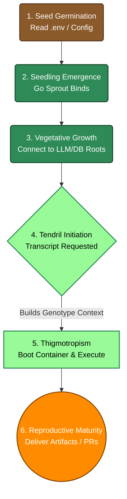

# Synthetic Biological Taxonomy & Systematics

OpenTendril replaces traditional, generic IT terminology with biological and botanical metaphors. By mimicking evolutionary and natural systems—systems that have spent billions of years optimizing for resilience, modularity, and rapid adaptation—OpenTendril achieves a highly robust and dynamic cognitive architecture. 

This document serves as the formal **Taxonomy and Systematics** of this synthetic organism. It educates contributors (and non-biologists!) on exactly how these organic concepts map directly to modern LLM engineering paradigms, classifying the nomenclature and explaining *why* we built the system this way.

---

## 1. The Philosophy: Escaping Determinism

In traditional software engineering, a **Task** implies deterministic, mechanical execution. If you give a computer a task (like a cron job or a build script), you expect it to blindly follow a rigid set of instructions and fail if anything deviates.

However, when interacting with Large Language Models, we are not issuing rigid tasks. We provide fuzzy prompts, relying heavily on the model's human-like reasoning, problem-solving, and educated guessing to navigate ambiguity. Forcing old-school, deterministic IT language (like "Task") onto a non-deterministic reasoning engine creates a fundamental disconnect in how developers architect the system.

OpenTendril solves this by embracing biological evolution—the exact same chaotic, adaptable, non-deterministic system that neural networks were originally modeled after. By using biological terminology, we inherently accept that our instructions require contextual interpretation rather than mechanical execution.

---

## 2. The Cognitive Anatomy

The core execution environment maps to the structural anatomy of a plant.

*   **Stem**: The Go-based orchestrator (`cmd/stem`). Just like a physical plant stem transports nutrients and structurally supports the plant, the Go Stem handles the HTTP networking, routing, and fundamental support structure for the AI.
*   **Sprout**: The ephemeral Docker sandbox. A sprout is a brand new, isolated shoot of growth. In OpenTendril, every time a Transcript executes, a fresh container (the Sprout) is created, providing a clean, isolated environment.
*   **Tendril**: The autonomous AI agent (the Python loop) running inside the Sprout. In nature, a tendril is a specialized stem/leaf that autonomously reaches out, senses its environment, and grasps objects to pull the plant forward. In our system, the Tendril autonomously reads files, runs commands, and accomplishes the user's objective.

---

## 3. The Immune System (Security & Quality Control)

Biological organisms must constantly defend against diseases and harmful mutations. OpenTendril models its security and testing pipelines after a biological immune system to ensure the framework stays healthy.

*   **Hormonal Triggers (The Acute Immune Response):** Pre-execution security gates. Plants use hormones (like auxins) to instantly trigger or halt growth based on environmental stimuli. In OpenTendril, Hormonal Triggers are lightweight bash scripts that intercept requests and can instantly "block growth" (abort execution) before the Tendril even boots if a threat or malformed request is detected.
*   **Automated Test Suite (The Adaptive Immune System):** Runs in isolated, sterile environments (Docker test containers) to constantly check the organism for sickness (bugs) and reject harmful mutations (failing PRs) before they can integrate into the core DNA.

---

## 4. The Genetic Prompt Hierarchy

To scale our prompt engineering dynamically, OpenTendril maps prompt layers to genetics.

*   **Genotype (Base Model Identity):** The core DNA of the AI. A Genotype is the foundational system prompt defining the overall identity, behavioral constraints, and role of the Tendril (e.g., "You are a Senior Go Engineer"). It is the fundamental blueprint. *(Common IT term: Persona or System Prompt)*.
*   **Plasmid (Modular Skill Injection):** In microbiology, a plasmid is a small, modular packet of DNA that can be transferred between cells to instantly grant them new traits (like antibiotic resistance). In OpenTendril, a Plasmid is a reusable, modular block of context or tools injected into a Genotype on the fly (e.g., "Here is the syntax documentation for React.js"). *(Common IT term: RAG context block or Tool definition)*.
*   **Transcript (Instruction Execution):** In biology, RNA transcription is the process of copying genetic instructions into a transient format (mRNA) that the cell immediately executes to perform an action. In OpenTendril, the Transcript is the one-off, contextual prompt fed to the Tendril for a single execution run (e.g., "Refactor this file"). *(Common IT term: User Prompt or Task)*.
*   **Sequence (Workflow Automation):** A defined genetic sequence dictating a complex chain of events. In OpenTendril, a Sequence is a predefined workflow that chains multiple Tendrils together (e.g., A Frontend Genotype writes the code, then a Testing Genotype reviews it). *(Common IT term: Agentic Pipeline or Workflow)*.

---

## 5. The 6-Stage Growth Model (Framework Lifecycle)

The execution flow of the OpenTendril framework natively maps to the six major growth stages of a climbing vine:

1. **Seed Germination (Activation):** The user installs OpenTendril. The Core reads `.env` and `mcp_config.json`, absorbing its environment.
2. **Seedling Emergence (Sprouting):** The Go Sprout breaks through and binds to local ports, establishing the main API surface.
3. **Vegetative Growth (Stem Elongation):** The core orchestrator ("The Stem") runs initial diagnostics and builds connections to LLM providers and local vector databases ("The Roots").
4. **Tendril Initiation:** When a specific Transcript is requested, the Stem initiates a specialized Genotype context, signaling cells to form a Tendril (`initiation.py`).
5. **Thigmotropism (The Search and Touch Response):** The Tendril emerges (a Docker container boots via `emergence.py`) and begins sweeping the air. It touches the code, coils around it (executing the LLM loop via `elongation.py`), and pulls the project forward.
6. **Reproductive Maturity:** With the Transcript completed, the framework redirects energy back to the user, producing final PRs, deliverables, and artifacts.



---

## Architectural Flow Summary

The interaction between the components looks like this in practice:

```mermaid
graph TD
    subgraph The Go Stem
        API[Incoming Request] --> HT[Hormonal Triggers]
        HT -- Growth Blocked --> Abort
        HT -- Growth Allowed --> OS[Sprout Spawner]
    end

    subgraph Ephemeral Sprout (Docker Sandbox)
        OS --> T[The Tendril AI]
        
        subgraph Genetic Injection
            G[Genotype: Core Persona] --> T
            P1[Plasmid: Skill A] -.-> T
            P2[Plasmid: Skill B] -.-> T
            TR[Transcript: Execution Instructions] --> T
        end
        
        T --> Env[Isolated Workspace]
    end

    classDef biological fill:#e8f5e9,stroke:#2e7d32,stroke-width:2px;
    classDef stem fill:#e0f7fa,stroke:#006064,stroke-width:2px;
    classDef sprout fill:#fff3e0,stroke:#e65100,stroke-width:2px;
    
    class G,P1,P2,TR,HT,T biological;
    class API,OS stem;
    class Env sprout;
```
