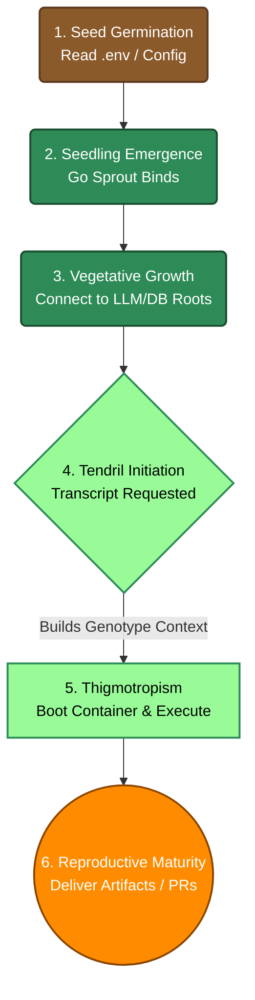
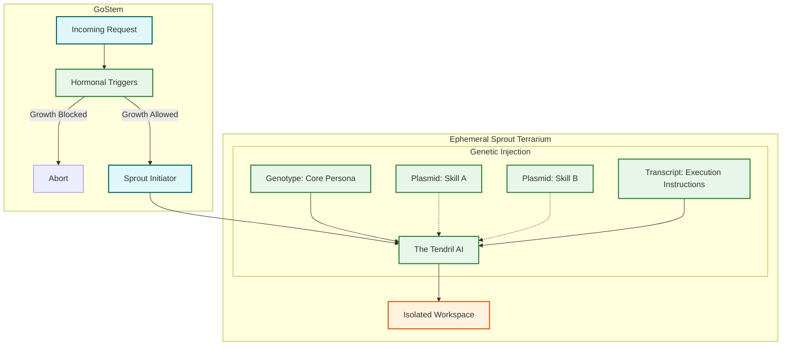

# Synthetic Biological Taxonomy & Systematics

OpenTendril replaces traditional, generic IT terminology with biological and botanical metaphors. By mimicking evolutionary and natural systems—systems that have spent billions of years optimizing for resilience, modularity, and rapid adaptation—OpenTendril achieves a highly robust and dynamic cognitive architecture. 

This document serves as the formal **Taxonomy and Systematics** of this synthetic organism. It educates contributors (and non-biologists!) on exactly how these organic concepts map directly to modern LLM engineering paradigms, classifying the nomenclature and explaining *why* we built the system this way.

> 🛠️ **Looking for how to build?** This document explains the *what* and *why*. For practical engineering decisions (which language to use where, how to build an executor), read the [Material & Architecture Guide](TENDRIL-GUIDE.md).
> 📖 **Need a quick translation?** If you are looking for a quick bidirectional mapping of OpenTendril terms to standard IT terms, see the [Glossary](GLOSSARY.md).
---

## 1. The Philosophy: Escaping Determinism

In traditional software engineering, computing is built on state machines. A **Task** implies deterministic, mechanical execution. If you give a computer a task (like a cron job or a build script), you expect it to blindly follow a rigid set of instructions. It either succeeds mathematically, or it throws an error.

However, Large Language Models are not state machines. They don't process binary logic—they process language, context, and probability. They are messy, adaptable, and highly organic. 

For the last few years, the tech industry has been trying to force these organic neural networks into rigid, deterministic IT boxes. Developers attempt to build "Agentic loops" that act like standard `while` loops, leading to fragile systems that break the moment a parameter is slightly unexpected, or suffer from severe context degradation over time. Furthermore, giving a stateful "Agent" continuous access to a host machine introduces catastrophic security risks.

OpenTendril solves this by embracing biological evolution—the exact same chaotic, adaptable, non-deterministic system that neural networks were originally modeled after. 

By modeling the system after a plant (Stems, Sprouts, Tendrils, Genotypes, and Hormones), we are building an architecture that inherently expects, and thrives on, dynamic environmental interpretation. By using biological terminology, we inherently accept that our instructions require contextual interpretation rather than mechanical execution, completely shifting the paradigm of how we orchestrate AI.

---

## 2. The Cognitive Anatomy

The core execution environment maps to the structural anatomy of a plant.

*   **Stem**: The Go-based orchestrator (`cmd/stem`). Just like a physical plant stem transports nutrients and structurally supports the plant, the Go Stem handles the HTTP networking, routing, and fundamental support structure for the AI.
*   **Vascular System (Xylem & Phloem)**: The transport mechanisms of the Stem. **Xylem channels** carry transcripts (inputs) from the Roots up to the active Sprouts (leaves). **Phloem channels** carry git diffs and code changes (synthesized sugar/energy) from the Sprouts back down to the Substrate (soil/host repository).
*   **Vascular Cambium (Vascular Bundles)**: The tissue within the stem that coordinates parallel xylem and phloem transport tubes. This maps to the concurrent step runner managing multiple isolated terrarium channels (parallel execution branches).
*   **Sprout**: The ephemeral Docker terrarium. A sprout is a brand new, isolated shoot of growth. In OpenTendril, every time a Transcript executes, a fresh container (the Sprout) is created, providing a clean, isolated environment.
*   **Tendril**: The physical worker (e.g. the Python or Go runtime) inside the Sprout. A tendril is *not* a brain—plants do not have brains. A tendril is a dumb, specialized limb that blindly reaches out, touches code, and runs shell commands based purely on chemical signals it receives.
*   **Rhizome (The Index Engine)**: A continuous underground stem network that stores nutrients and information, connecting the plant under the soil. In OpenTendril, the Rhizome acts as the foundational map of the entire project. It runs in the background, scanning the entire Substrate, parsing code, and storing a topological map of the repository into a local SQLite database for the AI to draw from.
*   **Mycorrhizal Network (The LLM)**: In nature, plants connect their roots to vast, subterranean fungal networks (Mycorrhizae) that act like a giant, distributed neural network. The Mycorrhizae process complex environmental data and send chemical instructions back to the plant. In OpenTendril, **the LLM is the Mycorrhizae**. It sits completely outside the physical plant (e.g. running in Claude on the host, or Ollama over the network), doing all the "thinking" and "predicting", and passing command signals into the dumb Tendril to execute.

---

## 3. The Immune System (Security & Quality Control)

Biological organisms must constantly defend against diseases and harmful mutations. OpenTendril models its security and testing pipelines after a biological immune system to ensure the framework stays healthy.

*   **Hormonal Triggers (The Acute Immune Response):** Pre-execution security gates. Plants use hormones (like auxins) to instantly trigger or halt growth based on environmental stimuli. In OpenTendril, Hormonal Triggers are lightweight bash scripts that intercept requests and can instantly "block growth" (abort execution) before the Tendril even boots if a threat or malformed request is detected.
*   **Automated Test Suite (The Adaptive Immune System):** Runs in isolated, sterile environments (Docker test containers) to constantly check the organism for sickness (bugs) and reject harmful mutations (failing PRs) before they can integrate into the core DNA.

---

## 4. The Genetic Prompt Hierarchy

To scale our prompt engineering dynamically, OpenTendril maps prompt layers to genetics.

*   **Genotype (Base Model Identity):** The core DNA of the AI. A Genotype is the foundational system prompt defining the overall identity, behavioral constraints, and role of the Tendril (e.g., "You are a Senior Go Engineer"). It is the fundamental blueprint. Critically, a Genotype defines *who the Tendril is and how it should think* — it does not define *what workflow to run*. *(Common IT term: Persona or System Prompt)*
*   **Plasmid (Modular Skill Injection):** In microbiology, a plasmid is a small, modular packet of DNA that can be transferred between cells to instantly grant them new traits (like antibiotic resistance). In OpenTendril, a Plasmid is a reusable, modular block of context or tools injected into a Genotype on the fly (e.g., "Here is the syntax documentation for React.js"). *(Common IT term: RAG context block or Tool definition)*
*   **Transcript (Instruction Execution):** In biology, RNA transcription is the process of copying genetic instructions into a transient format (mRNA) that the cell immediately executes to perform an action. In OpenTendril, the Transcript is the one-off, contextual prompt fed to the Tendril for a single execution run (e.g., "Refactor this file"). *(Common IT term: User Prompt or Task)*
*   **Sequence (Workflow Automation):** A defined genetic sequence dictating a complex chain of events. In OpenTendril, a Sequence is a predefined YAML workflow that *orchestrates* multiple Tendrils, each running a specific Genotype. A Sequence defines *what steps to run and in what order* — it does not define how to think. A Sequence is initiated by **activating the meristem** (the growth center), and can only be triggered by the Stem or a human operator — never by a Tendril operating inside a Terrarium Sandbox. *(Common IT term: Agentic Pipeline or Workflow)*
*   **Meristem Step (Dynamic Planning Node):** A sequence step that dynamically plans or generates new steps during execution. Named after **Meristematic tissue** which divides to branch out new shoots. *(Common IT term: Workflow Conductor or Planner)*
*   **Phenotypes (Speculative Variations):** Multiple speculative shoots or runs executing the same Transcript in parallel. Under **Phenotypic Selection (Natural Selection)**, Go Stem dispatches concurrent Sprouts under different environmental parameters (varying LLM temperatures or Plasmid rules), and merges only the first variant that compiles and passes the fitness test suite, weeding out weaker mutations. *(Common IT term: Speculative Parallel Execution)*

### System Genotypes and System Sequences

A critical distinction exists between *workspace-level* and *system-level* definitions:

*   **Workspace Genotypes/Sequences** live in `.tendril/genotypes/` and `.tendril/sequences/` within the project repository. They are user-customisable but are not trusted for privileged operations — a Tendril inside a Terrarium can read and modify these files, so they cannot be the basis for security decisions.

*   **System Genotypes/Sequences** are shipped with OpenTendril and installed to `~/.opentendril/` or `/etc/opentendril/`. They are **never mounted into any Terrarium container**, making them physically inaccessible to any agent. They carry immutable `deny` lists of blocked Plasmids, ensuring a single-responsibility design that provides both:
    1. **Security isolation** — a `github-ops` Genotype cannot accidentally (or maliciously) write to the filesystem, even if injected with a crafted Transcript.
    2. **Reliability** — fewer Plasmids means fewer dependencies and a narrower blast radius when something goes wrong.

> 📐 See [docs/ARCHITECTURE-TAXONOMY.md](docs/ARCHITECTURE-TAXONOMY.md) for visual diagrams of the Genotype hierarchy and trust boundaries.
> 📋 See [docs/DESIGN-SYSTEM-SEQUENCES.md](docs/DESIGN-SYSTEM-SEQUENCES.md) for the full System Sequences RFC including pre-built Git workflow definitions.
> 🐙 Tracking Issues: [#115 — System Genotypes](https://github.com/opentendril/core/issues/115) · [#116 — System Sequences & Git Workflows](https://github.com/opentendril/core/issues/116)

---

## 5. The 6-Stage Growth Model (Framework Lifecycle)

The execution flow of the OpenTendril framework natively maps to the six major growth stages of a climbing vine:

1. **Seed Germination (Activation):** The user installs OpenTendril. Go Stem reads `.env`, `mcp-config.json`, and `substrates.yaml`, absorbing its environment configuration.
2. **Seedling Emergence (Sprouting):** The Go Stem server boots and binds to local ports, establishing the main API and MCP surface areas.
3. **Vegetative Growth (Stem Elongation):** The core orchestrator ("The Stem") runs initial diagnostics and builds connections to LLM providers ("The Roots") using the Dual LLM config (Coordinator + Worker).
4. **Tendril Initiation:** When a specific task Transcript is requested, the Stem initiates a specialized Genotype context, dynamically resolving required Plasmids.
5. **Thigmotropism (The Search and Touch Response):** The Tendril emerges (a stateless Sprout Docker container is grown) and sweeps the codebase. Under the **Codebase Assessor (Thigmotropism)**, the Stem generates a hierarchical **Repo Map Plasmid** (`repomap.md`) using native AST parsing, giving the sprout a tactile sense of the codebase architecture before coiling around it to execute edits.
6. **Reproductive Maturity:** With the task completed, Go Stem runs post-flight sanitization, commits the changes, merges the terrarium worktree back to the host, and delivers the final PRs and artifacts.

---

## 6. Lamarckian Epigenetics (State Adaptation)

In biology, Lamarckian evolution states that an organism can pass down traits and adaptations acquired during its lifetime to its offspring. 

OpenTendril implements **Lamarckian Epigenetics** via the Go-native **Epigenetic Chronicler**:
*   After every Sprout execution, Go Stem analyzes the git diff and execution transcript to extract lessons, guardrails, and conventions learned during that specific run.
*   These learnings are automatically appended back to `.tendril/genome/epigenetics.md`.
*   During future Sprout runs, these accumulated learnings are compressed and injected into the prompt context.
*   This ensures future Sprouts (offspring) instantly inherit the acquired knowledge and mistakes of their predecessors, enabling self-improving codebase adaptation.

---

## Architectural Flow Summary

The interaction between the components looks like this in practice:

