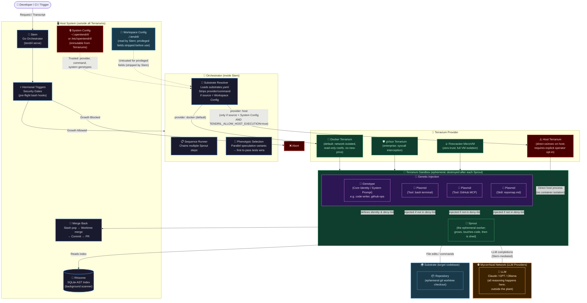
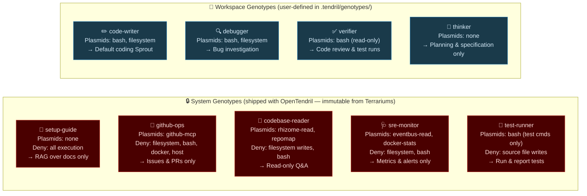
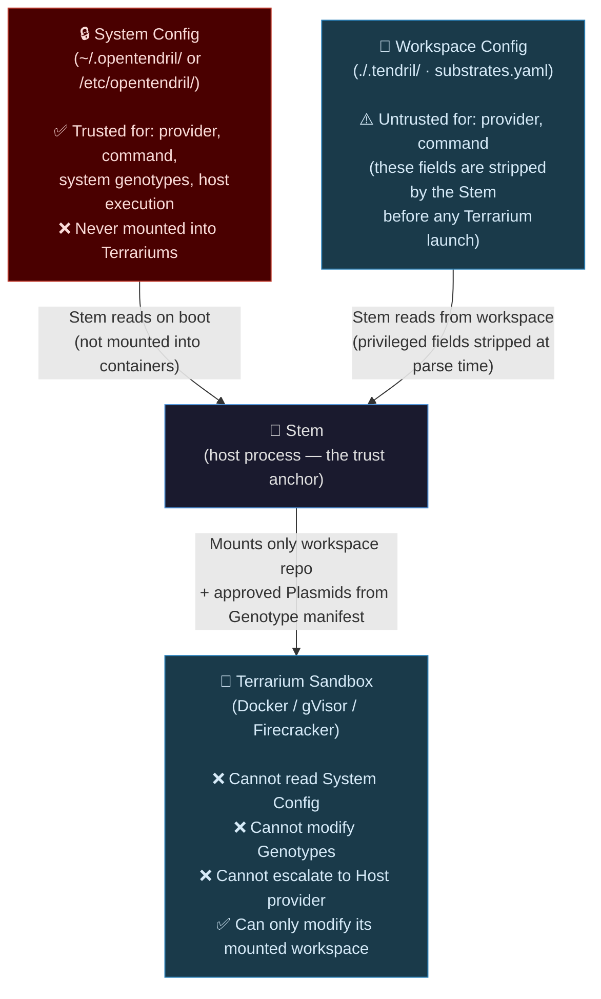

# OpenTendril Architecture Taxonomy

> **See also:** [SYNTHETIC-TAXONOMY.md](../SYNTHETIC-TAXONOMY.md) · [ARCHITECTURE.md](../ARCHITECTURE.md) · [SECURITY.md](../SECURITY.md)

This document provides visual architecture diagrams for OpenTendril, mapping the biological taxonomy to actual system components, security boundaries, and execution flows.

---

## 1. The Living Organism — Full Execution Pipeline

---

## 2. System Genotype Hierarchy

System Genotypes ship with OpenTendril and cannot be modified by agents operating within a Terrarium Sandbox. Workspace Genotypes are user-defined and can be customised per project.

> 📖 **See also:** the Pre-built System Genotypes design RFC.

---

## 3. Security Trust Boundaries

This diagram shows what each layer can and cannot access. A Terrarium Sandbox can **never** read System Config or modify Genotype definitions — these are host-level files that are never mounted into containers.

---

## Key Definitions Reference

| Biological Term | IT Equivalent | Security Role |
|---|---|---|
| **Stem** | Go Orchestrator | Trust anchor. Runs on host. Owns all security decisions. |
| **Mycorrhizal Network** | LLM (Claude/GPT/Ollama) | External. Never touches the host filesystem. |
| **Hormonal Trigger** | Security Gate / Hook | Pre-flight bash script. Blocks execution before Terrarium boots. |
| **Sprout** | One Terrarium execution run — the ephemeral worker | Created fresh, destroyed on completion. The executor: dumb by design, only follows Genotype instructions. *(Formerly split as "Tendril" for the worker loop; now a single organ.)* |
| **Terrarium** | Docker / gVisor / Firecracker / Host | Isolation layer. Defines the security boundary. |
| **Genotype** | System Prompt / Persona | Defines identity, capability scope, and **deny-list** of blocked tools. |
| **Plasmid** | Tool / RAG context block | Modular capability injected at runtime. Blocked by Genotype deny-list. |
| **Substrate** | Target Repository | The codebase being operated on. Mounted read-write into the Terrarium. |
| **Rhizome** | Background AST Index | Host-resident scanner. Read-only from Terrariums via API. |
| **Phenotype** | Speculative parallel variant | Multiple concurrent Sprouts racing to pass tests. |
